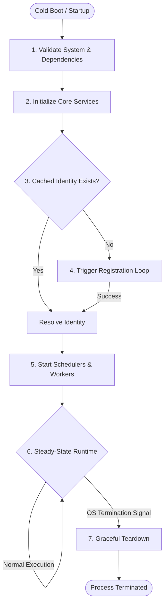

# Execution Watchdog Architecture Manual
## Chapter I — Agent Lifecycle

This chapter outlines the lifecycle of the Execution Watchdog Agent, describing its purpose, conceptual state progression, steady-state runtime operations, and design rationale.

---

### 1. Purpose

The primary role of the **Execution Watchdog Agent** is to operate as an autonomous, local supervisor for algorithmic trading systems. It runs directly alongside trading engines in target environments (such as VPS instances or private servers) to guarantee continuous operational oversight.

Crucially, the Agent acts as a **fail-closed supervisor**:
*   **Continuous Local Monitoring:** It monitors infrastructure health (system resources, container statuses, and network connectivity) and operational parameters (trading pipeline, latency, and trading engine heartbeat activity).
*   **Autonomous Alerting:** In the event of a critical failure or drift in system metrics, it logs incidents locally and publishes alerts to the Cloud Gateway.
*   **Fail-Closed Principle:** If the Agent detects that the trading engine is unresponsive, or that its own connection to the Cloud Gateway is severed beyond critical thresholds, it safely alerts stakeholders. It is designed to ensure that silent failures—where a trading bot goes offline or freezes, yet the administrator remains unaware—are impossible.
*   **Decoupled Architecture:** The Agent coordinates local data collection while remaining decoupled from cloud persistence. It buffers telemetry locally when the cloud is unreachable, preserving the integrity of incident logs.

---

### 2. Architecture & Ecosystem Context

The Agent is a long-running daemon designed to run continuously in a non-blocking execution environment, maintaining a minimal resource footprint while ensuring high telemetry frequency.

#### 2.A. System Ecosystem
The following diagram illustrates where the Agent sits in the overall system hierarchy and how data flows between operators, the cloud, and the local trading infrastructure:

```
    Operator
       │
       ▼
   Dashboard
       │
       ▼
 Cloud Gateway
     ▲   │
     │   │ (HTTP / WS Control)
     │   ▼
Execution Watchdog Agent
     ▲   │
     │   │ (REST APIs / Webhooks / WebSockets)
     ▼   ▼
 Trading Platform
```

#### 2.B. Internal Layering
The Agent consists of three main architectural layers:
1.  **Ingestion & Adapters:** Dedicated connectors (e.g., REST API adapters, Webhook receivers, and WebSocket streams) that tap into the trading platform's event streams and query its state.
2.  **Telemetry & Schedulers:** Independent, concurrent background loops that inspect system resources and evaluate operational rules.
3.  **Outbox Synchronization:** A persistent transactional outbox pattern that buffers incident records locally and synchronizes them with the Cloud Gateway via a stateless HTTP API.

---

### 3. High-Level Lifecycle Flow

The Agent's lifecycle consists of four main phases: Boot, Identity Resolution, Runtime Operation, and Graceful Shutdown.



The detailed message and request-level sequences for these phases are documented in [Appendix: Protocol Sequence Diagrams](appendix-sequence-diagrams.md).

---

### 4. Boot Phase

When the Agent process starts, it initiates a sequential, fail-fast boot sequence to verify its execution environment before launching background tasks.

#### 4.A. Dependency Validation
The Agent requires access to local system dependencies and persistent storage to execute its routines:
1.  **Validate Environment Variables:** The Agent reads the environment configuration, verifying that all mandatory database connection strings and licensing credentials are present.
2.  **Verify Persistent Store Connection:** The Agent initiates a database connection check. If the local storage is missing, unreachable, or rejects the connection, the Agent logs a critical diagnostic error and terminates the process immediately (**fail-fast**).
3.  **Initialize Notification Providers:** The Agent checks for optional local notification credentials. If they are missing, it logs a startup warning alerting that alert delivery will rely exclusively on the Cloud Gateway's routing systems.

#### 4.B. Service Instantiation
Upon successful validation, the orchestrator instantiates core management engines:
*   **Infrastructure Controller:** Dedicated to polling local system metrics and executing system commands safely.
*   **Incident Manager:** The logical center that aggregates anomalies, filters duplicates, maintains active incident states, and manages incident escalation rules.
*   **Outbox Sync Worker:** Manages the persistent queue of alerts and database incidents.

#### 4.C. Local Identity Store Loading
The final step of the boot phase is checking for cached credentials:
*   The Agent attempts to read its local identity store file.
*   If the credentials exist and match the expected schema, the system loads them and transitions immediately to the resolved state.
*   If the credentials are missing, corrupted, or have an invalid schema, the Agent triggers the background registration loop.

---

### 5. Identity & Registration

The Identity & Registration phase resolves the Agent's identity. The Agent cannot establish normal operations or start telemetry reporting until an identity is resolved.

#### 5.A. Registration Protocol
When no cached identity is found:
1.  **Machine Identification:** The Agent generates a persistent machine identifier bound to the hardware instance.
2.  **Registration Request:** The Agent sends an asynchronous identity request to the Cloud Gateway, providing its customer licensing key, machine identifier, OS hostname, version details, and local protocol capability flags.
3.  **Gateway Handshake & Verification:** The gateway validates the request. If the token is invalid, registration halts. If the version is outdated, the gateway flags a warning. If valid, the gateway issues a unique Agent ID and a cryptographically signed secret.
4.  **Credential Persistence:** The Agent writes these resolved credentials, alongside its negotiated capability list, directly into the local identity store.

#### 5.B. Non-Blocking Background Registration
To prevent network latencies or temporary gateway outages from stalling the host system's start sequence:
*   The orchestrator boot sequence finishes, allowing local service containers to run.
*   The registration loop runs in the background, utilizing an **exponential backoff retry strategy** (doubling the retry delay on every failure up to a configured cap).
*   If the gateway rejects the registration with an invalid token status, the retry loop halts immediately. This prevents the Agent from flooding the Cloud Gateway with invalid requests when manual administrative action is required.
*   *For a detailed message-level sequence, see [Appendix A.1. Registration Sequence](appendix-sequence-diagrams.md#appendix-a1-agent-registration-sequence).*

---

### 6. Runtime Initialization

Once the Agent's identity is resolved (either loaded from the cache or acquired through registration), the identity service fires its registration callback system. This signals the orchestrator to initialize the background schedulers and workers.

#### 6.A. Independent Background Schedulers
The Agent's runtime architecture is built around independent background schedulers that manage specific aspects of system health:
1.  **Heartbeat Scheduler:** Runs on a frequent periodic interval (default: 30 seconds). It compiles local hardware metrics and database health, submitting a heartbeat payload to the Cloud Gateway.
2.  **Configuration Scheduler:** Runs on a slow periodic interval (default: 5 minutes). It synchronizes the Agent's runtime settings (alert thresholds, monitor parameters) with settings managed via the Cloud developer panel.
3.  **Outbox Sync Worker:** Runs on a frequent periodic interval (default: 30 seconds). It reviews the local outbox database table and attempts to upload pending records in batches to the Cloud.
4.  **Advisory Update Checks:** Software update checks are advisory. Because automated updates can disrupt active trading strategies, version checking is executed either on startup or managed by external systemd/Ansible provisioners, avoiding uncoordinated automatic restarts during active trading.

#### 6.B. Separation of Schedulers
Every scheduler operates within its own execution context. A network block or slow database operation in the Outbox Sync Worker will not delay the Heartbeat Scheduler or interrupt local monitoring loops. This separation prevents single-point failure cascades within the agent's monitoring framework.

---

### 7. Runtime Operation

The runtime phase is the core of the Agent's lifecycle. Once initialized, the Agent runs continuously, coordinating multiple concurrent processes.

#### 7.A. Concurrency & Task Independence
The Agent coordinates several background loops that execute concurrently and independently:
*   **Infrastructure Diagnostic Loop:** Executes periodic host diagnostics (testing virtual machine health, docker container statuses, DNS resolution, and exchange reachability).
*   **Operations Diagnostic Loop:** Queries the trading platform adapter for strategy metrics, latency, and trading engine heartbeat activity.
*   **Anomaly Detection Loop:** Scans database logs for system anomalies, checking if loops have frozen or if the trading bot has ceased producing execution logs.
*   **Incident Auto-Resolution Loop:** Evaluates whether previous failures (such as a database disconnection) have resolved. If a component reports healthy state for a consecutive window, the incident status is marked resolved.

These loops run independently. If the Operations Diagnostic Loop blocks while querying an unresponsive trading bot, the Infrastructure Diagnostic Loop continues monitoring system resources without interruption.

#### 7.B. Event-Driven vs. Timer-Driven Architecture
The Agent combines timer-driven and event-driven architectures to optimize resource usage and response times:
*   **Timer-Driven Tasks:** Diagnostic loops and schedulers execute on configured periodic timers. This ensures predictable telemetry updates and prevents resource exhaustion.
*   **Event-Driven Tasks:** The REST API and WebSocket adapters receive real-time events (such as order updates, trade events, and webhooks) from the trading platform. These events are processed immediately, bypassed from the periodic timers, and logged to the local database or added to the outbox queue.

#### 7.C. State Ownership & Local Persistence
The Agent maintains strict state ownership:
*   **Active Incidents:** The local Incident Manager is the single source of truth for active incidents. It maintains their status (triggered, acknowledged, resolved) in the local database.
*   **Outbox Backlog:** Telemetry alerts and incident reports are written to a persistent outbox queue. This queue is owned by the Outbox Sync Worker, which guarantees delivery even across process restarts.
*   **Configuration Settings:** The active configuration parameters and revision counter are stored in an in-memory manager, which is updated only when the configuration sync protocol succeeds.

#### 7.D. Event Flow
When an anomaly is detected during runtime:
1.  A diagnostic loop detects a failure (e.g., latency exceeding the configured threshold).
2.  The diagnostic loop reports the failure to the **Incident Manager**.
3.  The Incident Manager checks if an active incident exists for this source. If not, it creates a new incident, generates an alert payload, and writes it to the **Local Database Outbox**.
4.  The **Outbox Sync Worker** picks up the pending alert in its next cycle and attempts to transmit it to the Cloud Gateway.

---

### 8. Failure & Self-Healing

The Agent is designed to operate reliably in unstable network environments and recover automatically from connection drops, credential revocation, and backend sync failures.

#### 8.A. Network Loss & Outbox Buffering
When network connectivity to the Cloud Gateway is lost:
1.  **Local Outbox Persistence:** The Incident Manager continues monitoring. When an anomaly is detected, the alert is wrapped in an outbox payload and written to the database outbox table.
2.  **Outbox Backoff Retry:** The Outbox Sync Worker tries to send the pending records. When operations fail due to timeouts, the worker increments the record's retry counter and calculates an exponential backoff time before retrying.
3.  **Heartbeat Backoff:** The Heartbeat Scheduler attempts transmission. If the transmission fails, the Agent logs a diagnostic warning details locally, retains the scheduling loop, and continues local diagnostics.
4.  *For a detailed diagram, see [Appendix A.3. Heartbeat Sequence](appendix-sequence-diagrams.md#appendix-a3-heartbeat-and-capability-negotiation-sequence).*

#### 8.B. Credential Expiration & Revocation
If the Agent's credentials are deleted or revoked on the Cloud Gateway:
1.  **Authorization Failure Interception:** The Heartbeat Scheduler receives an unauthorized or invalid token response code from the gateway.
2.  **Identity Reset:** The Agent immediately stops the heartbeat timer and commands the identity service to execute a reset.
3.  **Local Cache Deletion:** The identity service deletes the local identity store and resets the in-memory credentials.
4.  **Re-registration Cycle:** The service generates a new machine identifier and starts the non-blocking background registration loop. Once a new identity is issued by the Gateway, the schedulers restart automatically.
5.  *For a detailed diagram, see [Appendix A.4. Recovery Sequence](appendix-sequence-diagrams.md#appendix-a4-recovery--re-registration-sequence).*

#### 8.C. Configuration Synchronization Failure
If the Configuration Scheduler is unable to reach the gateway or receives a server error:
1.  **Keep Last Known Good (LKG) State:** The Configuration Scheduler catches the connection failure. Instead of resetting or crashing, it logs a warning.
2.  **Retain Configuration:** The configuration manager retains its existing configuration settings and the current configuration revision counter in memory.
3.  **Continuous Monitoring:** The monitoring engine continues checking the system using the last successfully synced configuration parameters.

---

### 9. Graceful Shutdown

To maintain database integrity and clean connection states, the Agent intercepts termination signals from the operating system and performs a structured shutdown.

#### 9.A. Intercepting OS Signals
The orchestrator registers listeners for termination signals:
*   `SIGINT` (typically triggered by a command-line interrupt).
*   `SIGTERM` (typically triggered by system service managers or container stop commands).

#### 9.B. Teardown Sequence
Upon receiving a signal, the Orchestrator executes these operations in order:
1.  **Stop Schedulers:** Clear heartbeat and configuration sync timers.
2.  **Stop Workers:** Stop the outbox synchronization worker and clear active retry timeouts.
3.  **Disconnect Adapters:** Terminate WebSocket connections and stop polling REST interfaces.
4.  **Flush Data:** Commit pending outbox operations and flush volatile logging buffers.
5.  **Close Connections:** Disconnect from the local database store.
6.  **Exit:** Terminate the process cleanly.

---

### 10. Component Responsibilities

The following table maps key system components to their responsibilities and lifecycle phases.

| Component | Responsibility | Lifecycle Phase |
| :--- | :--- | :--- |
| `AgentIdentityService` | Manages registration requests, local credential persistence, token validation, capabilities negotiation, and credential clearing during re-registration. | **Boot & Runtime** |
| `IdentityStore` | Manages reading and writing the identity configuration file. Generates unique machine identifiers and handles corrupted identity recovery. | **Boot** |
| `AgentHeartbeatScheduler` | Gathers hardware telemetry metrics and manages the periodic heartbeat submission loop. Initiates identity reset upon auth failures. | **Runtime** |
| `AgentConfigurationScheduler` | Runs the periodic configuration synchronization loop, handling conditional updates and fallback config retention. | **Runtime** |
| `AgentConfigurationManager` | Global singleton memory store for the active configuration parameters and revision counter. | **Runtime** |
| `OutboxSyncWorker` | Queries local outbox records, executes batch uploads, and calculates exponential backoff retry timings. | **Runtime** |
| `CloudAgentClient` | Stateless HTTP gateway client wrapping endpoints for register, heartbeat, config, and software update checks. | **Runtime** |
| `IncidentManager` | Aggregates anomalies, manages active incidents database records, and writes outbound incidents to the outbox queue. | **Runtime** |
| `WatchdogOrchestrator` | Main controller daemon class that validates environment, manages system startup, handles signals, and shuts down services. | **Boot & Shutdown** |

---

### 11. Design Rationale

The Agent's architecture is shaped by six fundamental design choices.

#### 11.A. Why Stateless HTTP?
To maximize scalability and simplify deployment, all communications between the Agent and the Cloud Gateway are stateless. Every request carries its own authentication headers, software version parameters, and capability list. This eliminates the need for session stickiness or state tracking at the gateway layer, enabling simple load balancing and horizontal scaling.

#### 11.B. Why Outbox Instead of Direct Publishing?
Directly publishing alerts over the network makes the monitoring system vulnerable to connection drops. If the network is down when an alert is generated, the alert is lost. By persisting alerts in a local database outbox table before transmission, the Agent guarantees delivery. Telemetry and incident records remain buffered on disk and are synchronized as soon as the connection is restored.

#### 11.C. Why Revision-Based Configuration?
To minimize bandwidth and optimize gateway response times, the Agent uses a revision-based configuration model. Instead of fetching the entire configuration JSON every 5 minutes, the Agent sends its current revision number (e.g. `14`) in the request header. If the gateway has no newer revision, it returns a lightweight `304 Not Modified` response, avoiding unnecessary payload transfers.

#### 11.D. Why Independent Schedulers?
Each scheduler runs on its own interval timer and handles its own errors. If the Outbox Sync Worker stalls due to a slow network write, the Heartbeat Scheduler continues publishing system status without delay. This isolation prevents a slow network dependency in one service from degrading the performance of other monitoring functions.

#### 11.E. Why a Local Identity Cache?
Caching credentials locally enables the Agent to resume operations instantly after a crash or system reboot. By loading its identity from disk, the Agent avoids making redundant registration requests, reducing load on the Cloud Gateway and ensuring monitoring starts immediately.

#### 11.F. Why Separation of Responsibilities?
Each component does exactly one thing: `Heartbeat` is decoupled from `Configuration`, and `Authentication` is separated from `Capability Negotiation`. This makes the codebase easy to maintain, test, and audit.
