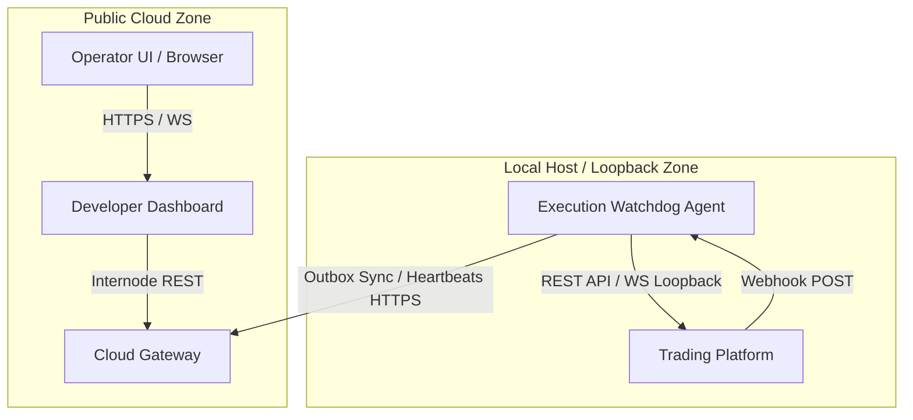

# Execution Watchdog Architecture Manual
## Chapter II — Communication Model

This chapter details the communication model of the Execution Watchdog system, describing the network architecture, interfaces, security boundaries, and interaction paradigms between the Agent, the Cloud Gateway, and the Trading Platform.

---

### 1. Purpose & Overview

The Execution Watchdog Agent operates as an intermediary boundary system. It isolates and protects the host runtime of algorithmic trading systems from directly managing high-latency public networks, while providing the central Cloud Gateway with a reliable, stateless status stream.

The core communication architecture relies on three primary design criteria:
*   **Local Low-Latency Monitoring:** Querying and receiving data from the adjacent trading platform (e.g., Freqtrade) via low-latency loopback channels.
*   **Asynchronous External Coupling:** Reporting aggregated telemetry and active alerts to the Cloud Gateway via stateless, firewall-friendly outbound HTTP requests.
*   **Decoupled Sync Loops:** Ensuring that network disconnections or latencies on the public internet do not stall the local event-reconciliation engine or local diagnostic checking.

---

### 2. System Communication Topology

The overall system communication topology defines how messages traverse security and network zones.

The system is segregated into three distinct execution boundaries:
1.  **Public Cloud Zone (WAN):** Houses the developer dashboard and the Cloud Gateway. It processes incoming telemetry, hosts settings registries, and handles user alerts.
2.  **Local Loopback Boundary (LAN / Host VM):** Encompasses the local Agent daemon and the Trading Platform. Communication within this zone is restricted to loopback adapters (`localhost` or internal virtual networks), preventing direct exposure of the trading engine's administration ports to the public WAN.
3.  **Outbound Data Flow:** The Agent initiates all outbound traffic to the Public Cloud Zone. It does not accept inbound connections from the WAN, which mitigates common ingress security risks.

---

### 3. Interaction Channels

#### 3.A. Agent-to-Gateway Channel
The connection between the Agent and the Cloud Gateway handles state reporting, telemetry updates, and configuration synchronization:
*   **Characteristics:** Initiated exclusively by the Agent. It uses standard HTTPS over TCP port 443.
*   **Pull Interface:** Periodically queries configuration revisions and licensing validation details.
*   **Push Interface:** Publishes structured event batches from the local transactional outbox.
*   **Control Response Handshake:** The Gateway sends command instructions (e.g., capability adjustments or software update recommendations) exclusively inside the responses to Agent-initiated HTTP operations.
*   *See [Chapter III — Request Matrix] and [Chapter IV — Header Contracts] for request specification details.*

#### 3.B. Agent-to-Trading-Bot Channels
To monitor and manage the trading engine, the Agent establishes three separate communication channels:
1.  **Outbound REST API Adapter:** The Agent queries the trading engine's local administration API via loopback connections (using Basic Authentication). This polling retrieves metrics (heartbeats, engine health, broker connection statuses, and order lists) to reconcile against local system configurations.
2.  **Inbound Webhook Receiver:** The Agent spins up a lightweight HTTP server bound exclusively to localhost loopback interfaces. The trading platform is configured to POST trade entry, fill, and cancel notifications directly to this endpoint as they occur, ensuring real-time ingestion.
3.  **Inbound WebSocket Stream:** A persistent socket connection established by the Agent to the trading engine's local WS port. It streams real-time state changes, including order entries, exits, candle updates, and strategy errors.
*   *See [Chapter V — Configuration Protocol] and [Chapter VI — Update Protocol] for detailed data exchange rules.*

---

### 4. Communication Paradigms

To maximize reliability and performance, the system combines four interaction paradigms.

#### 4.A. Request-Response Handshake
*   **Description:** Sync loops that follow a transactional pattern where the Agent makes a request and waits for validation and payload negotiation from the Gateway before applying changes locally.
*   **Application:** User registration, handshake licensing checks, and configuration revision checks.
*   **Logical flow:** `Request` &rarr; `Negotiation` &rarr; `Response` &rarr; `Apply Changes`.

#### 4.B. Pull-Based Synchronization (Configuration & Heartbeats)
*   **Description:** The Agent uses periodic HTTP polling loops to keep the host in sync with the central controller.
*   **Application:** Used for heartbeats and configuration syncs.
*   **Benefit:** By pulling configuration changes and authorization states, the Agent controls the rate of traffic, preventing external overload.

#### 4.C. Push-Based Ingestion (WebSockets & Webhooks)
*   **Description:** Real-time event propagation pushed by the trading bot to the Agent as events occur.
*   **Application:** Used for trade entries, trade fills, exits, and system warnings.
*   **Benefit:** Provides low-latency event capture. WebSocket streams provide immediate orderbook and candle tracking, while HTTP webhooks provide redundancy for critical status transitions.

#### 4.D. Transactional Outbox (Reliable Sync)
*   **Description:** Instead of sending incidents directly over the WAN when detected, the Agent writes them to a local SQL-based Outbox database table.
*   **Application:** All local anomalies, metric breaches, and incident state changes.
*   **Benefit:** Decouples telemetry recording from network state. If the Cloud Gateway is offline or unreachable, the local state is preserved. A separate background worker retrieves pending outbox records and uploads them when connectivity is restored, implementing exponential backoff retry.

---

### 5. Communication Contracts & Transport

*   **External Gateway Communication (HTTPS + JSON):** The Agent communicates with the public gateway using HTTPS (TLS version 1.2 or 1.3). All payloads are formatted as JSON objects.
*   **Internal Streaming Ingestion (WebSocket):** The Agent establishes a persistent loopback TCP connection upgraded to the RFC 6455 WebSocket protocol. It subscribes to low-latency stream states, parsing raw stream events.
*   **Internal Event Notification (Webhook):** Standard HTTP POST operations target localhost loops, carrying simple JSON key-value pairs representing trade events.

---

### 6. Communication Security Model

The security model maintains three lines of defense:
1.  **Stateless Request Verification:** Every outbound HTTP request to the Cloud Gateway contains identification and cryptographic signature headers. The gateway validates these headers on every call, maintaining statelessness.
2.  **License Authorization:** During registration, the Agent submits a license key. The Gateway verifies the token and generates local credentials, preventing unauthorized agents from accessing the network.
3.  **Network Zoning & Interface Containment:** The webhook receiver and WebSocket clients bind only to localhost loopback interfaces. This prevents external hosts from accessing these endpoints, even if the host's firewall rules are misconfigured.

---

### 7. Communication Principles

The communication topology and interfaces are governed by five core principles:
*   **Principle 1: Agent Initiates All WAN Communication:** The Agent must establish all connections to the public cloud gateway. Inbound public network ports are never required, making the setup NAT-friendly and security-hardened.
*   **Principle 2: Gateway Never Initiates Communication:** The gateway must remain a passive responder to Agent requests, avoiding the need for permanent socket state tracking at scale.
*   **Principle 3: Trading Engine is Never Directly Exposed:** The trading platform must bind exclusively to the local loopback interface. Direct communication from the WAN to the trading bot is prohibited.
*   **Principle 4: Monitoring Continues Without Cloud Connectivity:** All metrics, anomalies, and logs must be stored locally. A WAN connection drop must not cause data loss or interrupt local monitoring.
*   **Principle 5: External Communication is Stateless:** Every request sent to the gateway must be independently authorized and authenticated via headers, avoiding sticky sessions or gateway session cache lookups.

---

### 8. Design Rationale

#### 8.A. Why REST/HTTP for Gateway Control Plane?
Stateless HTTP REST is highly compatible with standard firewall policies and proxy topologies, minimizing setup issues. Since the Gateway does not need to maintain persistent TCP sockets for hundreds of agents, server resources are preserved.

#### 8.B. Why WebSockets for Local Trading Engine Communication?
To verify strategy latency and react to order changes, the Agent requires sub-millisecond updates. WebSocket streams provide immediate notification when trades are executed, preventing delays that can occur with periodic polling.

#### 8.C. Why Local Loopback for Webhooks?
Receiving webhook push events directly on loopback interfaces keeps all ingestion local to the VPS or container env. No public ingress ports are opened on the router, keeping the server isolated from the public WAN.

#### 8.D. Why Decouple Sync Loops from Ingestion Adapters?
Decoupling the sync loops from the ingestion adapters isolates failures. If the WebSocket stream to Freqtrade drops, the REST adapters and outbox workers continue logging infrastructure status and uploading alerts. This prevents a single communication failure from disabling the entire watchdog.
