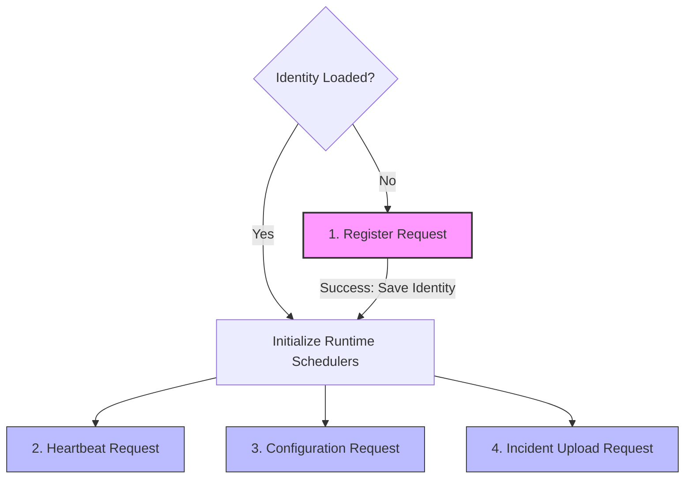

# Execution Watchdog Architecture Manual
## Chapter III — Request Matrix

This chapter catalogs the request landscape of the Execution Watchdog platform. It maps the distributed API contracts exchanged between the Agent and the Cloud Gateway, defining the owner, category, trigger conditions, state mutations, and coordination guarantees of every interaction.

---

### 1. Purpose & Scope

The Request Matrix serves as the system-level table of contents for all communication between the Execution Watchdog Agent and the Cloud Gateway. By defining the boundaries and responsibilities of each request, it establishes the contract upon which individual protocol chapters are built. 

In alignment with the architecture's design goals, this catalog focuses entirely on behavioral outcomes, system ownership, and state progression, leaving byte-level payload structures and headers to subsequent chapters.

---

### 2. Core Request Matrix

The following matrix documents the complete set of externally exposed Agent-to-Gateway interactions:

| Request | Category | Owner / Scheduler | Trigger Condition | Primary Responsibility |
| :--- | :--- | :--- | :--- | :--- |
| **Register** | Identity | `AgentIdentityService` | Bootstrap phase when credentials cache is missing or corrupt. | Establish local instance identity and exchange initial credentials. |
| **Heartbeat** | Health | `AgentHeartbeatScheduler` | Runtime operation periodic timer (default: 30 seconds). | Report infrastructure health, loop statuses, and connection sanity. |
| **Configuration** | Synchronization | `AgentConfigurationScheduler` | Runtime operation periodic timer (default: 5 minutes). | Sync remote parameters, monitoring rules, and target thresholds. |
| **Incident Upload** | Reliability | `OutboxSyncWorker` | Event-driven loop (when outbox queue contains records). | Guarantee at-least-once delivery of anomalies and alerts. |
| **Update Check** | Advisory | `AgentUpdateScheduler` | Startup check or daily scheduler (default: 24 hours). | Query the Gateway for software updates and capability advisories. |

---

### 3. Request Lifecycle Classification

The system classifies requests into three distinct execution lifecycles:

```
            [ Startup / Bootstrap ]
                       │
                       ▼
                 * Register *
                       │
                       ▼
         [ Runtime Operations Loop ]
      ┌────────────────┬────────────────┐
      │                │                │
      ▼                ▼                ▼
 * Heartbeat *    * Config *    * Incident Upload *
                       │
                       ▼
              [ Advisory Actions ]
                       │
                       ▼
               * Update Check *
```

1.  **Startup/Bootstrap Requests:** Core initialization tasks that block standard operational routines. These requests establish security contexts and verify structural parameters.
    *   *Includes:* **Register**.
2.  **Runtime Operations Requests:** Concurrent, background tasks executing continuously during normal operations. These requests handle telemetry transmission and state alignment.
    *   *Includes:* **Heartbeat**, **Configuration**, and **Incident Upload**.
3.  **Advisory Actions:** Passive, non-blocking inquiries that do not alter the active telemetry state or influence immediate control flows.
    *   *Includes:* **Update Check**.

---

### 4. Request Dependency Hierarchy

Except for advisory actions, the Agent's request sequence follows a strict dependency chain. Telemetry, configurations, and incidents cannot be synchronized until the Agent's identity is resolved.



*   **Identity Dependency:** The `Heartbeat`, `Configuration`, and `Incident Upload` requests depend on credentials generated by a successful `Register` request.
*   **Operational Isolation:** Once the identity is resolved, runtime operations run independently. A failure in `Incident Upload` will not prevent the `Heartbeat` or `Configuration` loops from executing.
*   **Advisory Independence:** `Update Check` requests can run before or during full identity resolution.

---

### 5. Detailed Request Breakdown

#### 5.A. Register
*   **Description:** Establishes the Agent's identity with the Cloud Gateway, validating the licensing token.
*   **Trigger Conditions:** Fired during the boot sequence if the local cache lacks valid, uncorrupted Agent credentials.
*   **State Lifecycle & Mutations:**
    *   *On Success:* Saves the issued Agent ID, secret token, and negotiated capabilities array to local non-volatile storage, then signals the Orchestrator to start runtime schedulers.
    *   *On Failure:* Remains in a bootstrap loop, executing an exponential backoff retry.
*   *See Chapter IV — Header Contracts for authentication headers and Appendix A.1 for the registration sequence.*

#### 5.B. Heartbeat
*   **Description:** Transmits hardware telemetry metrics, local database health, and active strategy monitoring status.
*   **Trigger Conditions:** Fired periodically by `AgentHeartbeatScheduler`.
*   **State Lifecycle & Mutations:**
    *   *On Success:* Updates the local connection tracker's last successful exchange timestamp.
    *   *On Failure (Network/Server):* Increments the failure counter and logs a local diagnostic warning, retrying on the next scheduled cycle.
    *   *On Failure (Authorization/Credentials Invalidated):* Resets the active memory credentials, deletes the cached identity store, halts the scheduler, and triggers the background registration loop.
*   *See Chapter IV — Header Contracts for credential headers and Appendix A.3 for the heartbeat sequence.*

#### 5.C. Configuration
*   **Description:** Pulls setting alterations, diagnostic thresholds, and alerting rules set in the Developer Dashboard.
*   **Trigger Conditions:** Fired periodically by `AgentConfigurationScheduler`.
*   **State Lifecycle & Mutations:**
    *   *On Success (New Revision Available):* Commits new parameters to the global `AgentConfigurationManager` and updates the active revision tracker.
    *   *On Success (No Revision Changes):* Keeps the existing configuration cache unchanged.
    *   *On Failure:* Retains the Last Known Good (LKG) configuration in memory and continues monitoring.
*   *See Chapter V — Configuration Protocol for settings schema and synchronization flows.*

#### 5.D. Incident Upload
*   **Description:** Emits batches of pending incidents, resource alerts, and trading anomalies written to the local database.
*   **Trigger Conditions:** Fired by the `OutboxSyncWorker` when records are present in the outbox table.
*   **State Lifecycle & Mutations:**
    *   *On Success:* Purges the successfully uploaded records from the local database outbox.
    *   *On Failure:* Marks the target records with an incremented retry counter and schedules an exponential backoff retry.
*   *See Chapter VII — Failure Recovery for outbox retry rules and error isolation.*

#### 5.E. Update Check
*   **Description:** Checks if a newer software version or configuration capability set is recommended.
*   **Trigger Conditions:** Fired on boot or daily by `AgentUpdateScheduler`.
*   **State Lifecycle & Mutations:**
    *   *On Success (New Version Available):* Emits a system notification advisory informing the administrator of update availability.
    *   *On Failure:* Logs an advisory warning but does not affect active monitoring or trading platforms.
*   *See Chapter VI — Update Protocol for upgrade workflows.*

---

### 6. Key Coordination Guarantees

The interactions in the Request Matrix are governed by four system guarantees:

#### 6.A. Communication Guarantees
*   **Agent-Initiated Invariant:** All WAN requests are initiated by the Agent. The Gateway processes requests and issues commands only in HTTP responses, eliminating the need for open inbound ports on the Agent host.

#### 6.B. Delivery Guarantees
*   **At-Least-Once Delivery:** All critical events, anomalies, and incident state changes must be written to the local outbox database before WAN transmission. The Agent guarantees that alerts are stored on disk and retried until a success acknowledgement is received.

#### 6.C. Consistency Guarantees
*   **Revision Synchronization:** To avoid config conflicts, the Agent submits its active configuration revision number. The configuration is updated only if the Gateway responds with a newer configuration revision number, ensuring the Agent's settings remain consistent.

#### 6.D. Failure Guarantees
*   **Self-Healing Isolation:** Failures in external API requests are isolated. A timeout during configuration fetches or incident uploads does not impact the system resource diagnostics or local Trading Platform monitoring loops.
*   **Last Known Good State:** The Agent must fall back to the last successfully synced configuration parameters (LKG) during Gateway outages, maintaining local operation.
