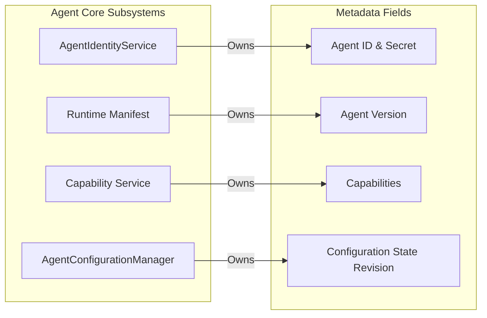

# Execution Watchdog Architecture Manual
## Chapter IV — Metadata Contracts

This chapter defines the metadata contracts shared between the Execution Watchdog Agent and the Cloud Gateway. It details the categories of metadata, their mapping to HTTP transport headers, mutability, ownership, and the trust boundaries that support a stateless distributed topology.

---

### 1. Purpose & Scope

In a distributed monitoring system, the gateway layer must validate, filter, and route messages efficiently. Rather than inspecting business payloads to determine context, the system relies on a **Metadata Contract** that accompanies every outbound transaction.

This metadata contract answers a critical architectural question:
> **How does every request carry identity, capability, and protocol state statelessly?**

By isolating routing, authentication, and revision tracking from standard business payloads, the Agent is able to communicate with the Gateway without maintaining active session state. Today, this metadata contract is implemented via custom HTTP headers, but the architectural definitions remain transport-independent.

---

### 2. Metadata Categories

Metadata is organized into four logical categories:
1.  **Identity Metadata:** Establishes the origin and authorization credentials of the requesting Agent.
2.  **Version Metadata:** Conveys the specific software build version of the Agent instance.
3.  **Capability Metadata:** Declares the functional integrations active on the Agent host.
4.  **Configuration Metadata:** Identifies the active settings state and revision index of the Agent's monitoring rules.

---

### 3. Core Metadata Directory

The following table documents the mapping of conceptual metadata fields to their current HTTP header implementations:

| Metadata Field | HTTP Header Implementation | Presence | Responsibility & Intent |
| :--- | :--- | :--- | :--- |
| **Agent ID** | `X-Agent-Id` | Conditional | Unique UUID identifying the specific Agent instance (required once registered). |
| **Agent Secret** | `X-Agent-Secret` | Conditional | Shared secret credential generated during registration (required once registered). |
| **Agent Version** | `X-Agent-Version` | Mandatory | Semantic version string indicating the Agent's active software release. |
| **Capabilities** | `X-Agent-Capabilities` | Mandatory | Comma-separated capabilities denoting the enabled features and Trading Platform integrations. |
| **Configuration State Revision** | `X-Configuration-Revision` | Conditional | Numeric counter representing the version of configuration rules active on the Agent. |

---

### 4. Metadata Lifecycle Transitions

Depending on the execution phase, different slices of the metadata contract are propagated with the request:

| Request Class | Identity Metadata | Version Metadata | Capability Metadata | Configuration Metadata |
| :--- | :--- | :--- | :--- | :--- |
| **Registration** | Not Yet Available | Propagated | Propagated | Not Yet Available |
| **Telemetry & Heartbeats** | Propagated | Propagated | Propagated | Not Yet Available |
| **Configuration Sync** | Propagated | Propagated | Propagated | Propagated |
| **Incident Uploads** | Propagated | Propagated | Propagated | Not Yet Available |
| **Advisory Update Checks** | Propagated | Propagated | Propagated | Not Yet Available |

*During registration, identity and configuration metadata are absent because they have not yet been negotiated or issued.*

---

### 5. Metadata Mutability

The lifecycle stability of metadata fields dictates how both the Agent and the Gateway cache and update operational parameters:

| Metadata Field | Mutability State | Description / Trigger Condition |
| :--- | :--- | :--- |
| **Agent ID** | **Immutable** | Issued upon successful registration; remains static for the lifetime of the Agent instance database. |
| **Agent Secret** | **Immutable** | Rotates only if the credentials are revoked by the Gateway, triggering a full re-registration cycle. |
| **Agent Version** | **Mutable** | Modifies exclusively upon execution of a system-level software package update and process reboot. |
| **Capabilities** | **Mutable** | Updates dynamically when integrations (such as WebSocket feeds or Trading Platform APIs) are toggled. |
| **Configuration State Revision** | **Mutable** | Increments sequentially as new configuration state packages are synced from the Developer Dashboard. |

---

### 6. Metadata Ownership

To prevent state synchronization conflicts within the Agent daemon, each metadata field is managed by a single authoritative subsystem:

*   **Agent Identity Service:** Authoritative for `Agent ID` and `Agent Secret`. It is the only component permitted to read from or write to the local credentials store.
*   **Runtime Manifest:** Provides the `Agent Version` metadata, derived from the build manifest bundled with the executable.
*   **Capability Service:** Provides the Agent's declared capability set based on the current runtime configuration and enabled Trading Platform integrations.
*   **Configuration Manager:** Owns the `Configuration State Revision`, managing version increments during settings synchronization cycles.

---

### 7. Metadata Trust Model

The security boundary between the Agent and the Gateway defines how metadata is authenticated and verified:
*   **Stateless Request Verification:** The Gateway treats all request metadata as untrusted until verified. The Gateway performs validation of the `Agent ID` and `Agent Secret` against its database for every incoming request.
*   **Transport-Level Confidentiality:** Because the metadata contract carries secret credentials and infrastructure configuration indexes, the system enforces transport-level encryption (HTTPS). Requests arriving via unencrypted HTTP are rejected by the gateway edge.
*   **Capability Ownership Trust:** The Agent owns the declaration of available capabilities, while the Gateway owns the authorization of those capabilities based on licensing and policy. The Gateway validates capabilities against the active license plan and can ignore or override Agent capabilities in control responses.

---

### 8. Metadata Design Principles

Five core principles govern metadata management:
*   **Propagated with Every Request:** Metadata travels alongside all transactions, ensuring the gateway requires no session state to validate requests.
*   **Single Source of Subsystem Ownership:** No two internal systems may write to or manage the same metadata field.
*   **Independent of Business Payloads:** Metadata is carried in transport headers, allowing edge proxies to route requests without parsing payload bodies.
*   **Evolves Independently from Business Data:** Changing the layout of telemetry event payloads does not break the metadata contracts required for routing and validation.
*   **Enables Control Handshaking:** Metadata elements such as configuration state revision numbers allow the system to negotiate state differences with minimal network bandwidth.

---

### 9. Design Rationale

#### 9.A. Why Request Metadata instead of Session State?
A stateful design requires the Cloud Gateway to maintain socket pools or distributed session caches (e.g., Redis) to track which agents are active and authenticated. This architecture scales poorly and is vulnerable to Gateway node disconnections. By carrying metadata with every request, the architecture remains fully stateless: any Gateway instance can process any Agent request instantly by performing quick database or credential checks.

#### 9.B. Why Transmit Capabilities as Metadata?
Tying features directly to message payloads makes it difficult for the Gateway to apply edge-level routing. By carrying capabilities as metadata, API gateways can block unsupported feature requests or route them to specific internal microservices without deserializing or examining the JSON payload body.

#### 9.C. Why Transmit Configuration Revisions as Metadata?
If the Agent had to fetch its full configuration payload every 5 minutes to verify settings alignment, the network overhead would be significant. By sending the active `Configuration State Revision` counter as metadata, the Gateway can instantly compare numbers. If no updates are present, the Gateway issues a lightweight response indicating no modification, saving computing resources and bandwidth.

---

### 10. Related Chapters

*   **Chapter II — Communication Model:** Explains how transport channels carrying this metadata are structured across WAN and local loopback adapters.
*   **Chapter III — Request Matrix:** Details when requests propagating this metadata are triggered and their local state mutations.
*   **Chapter V — Configuration Protocol:** Explores how the `Configuration State Revision` is verified and evaluated.
*   **Chapter VI — Update Protocol:** Outlines how the `Agent Version` is checked for advisory updates.
