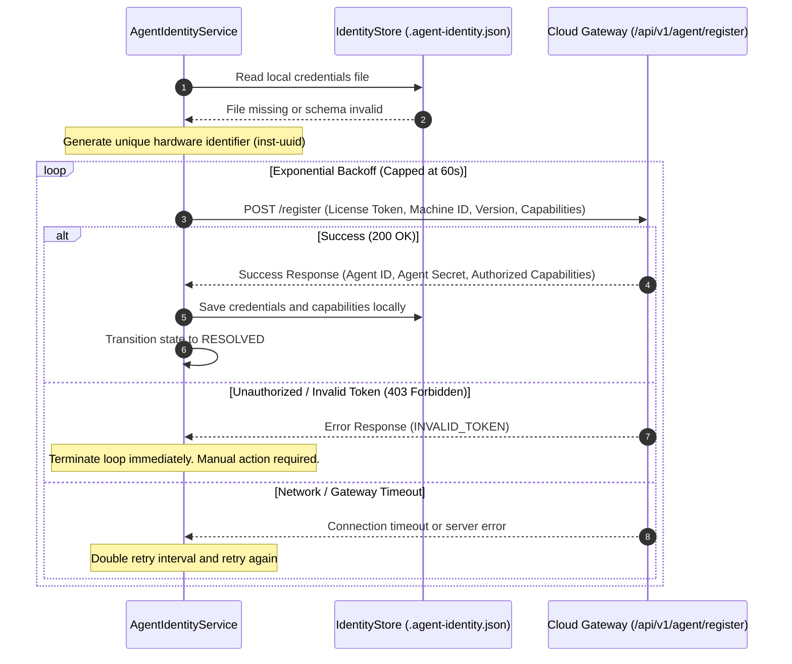
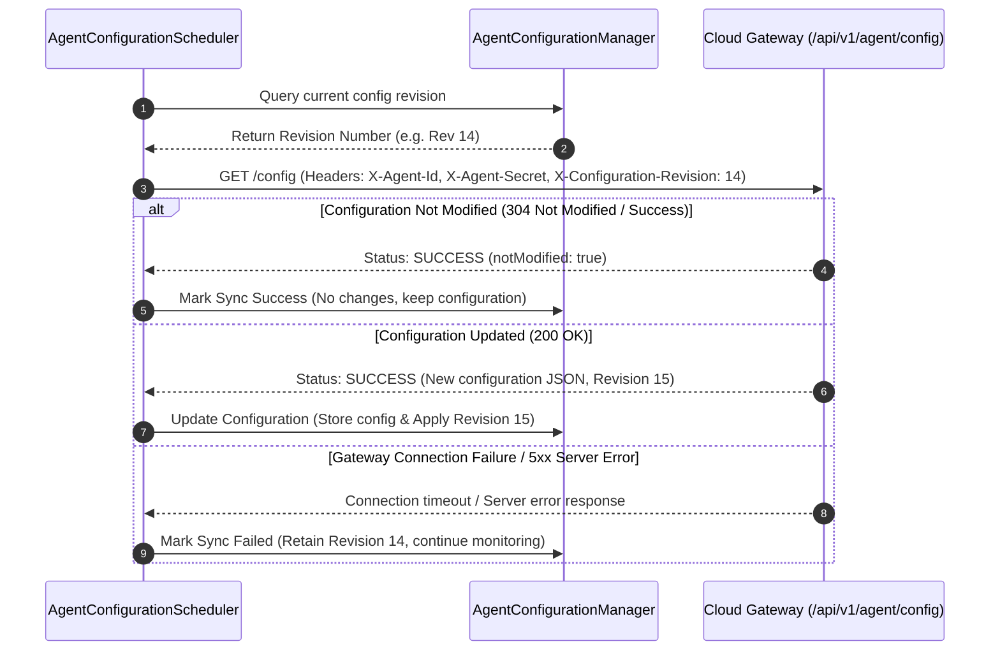
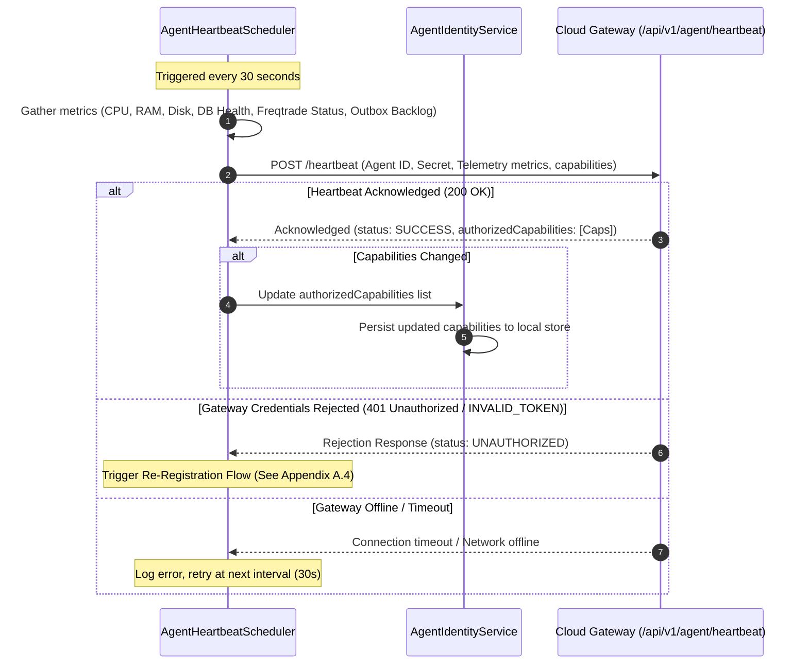
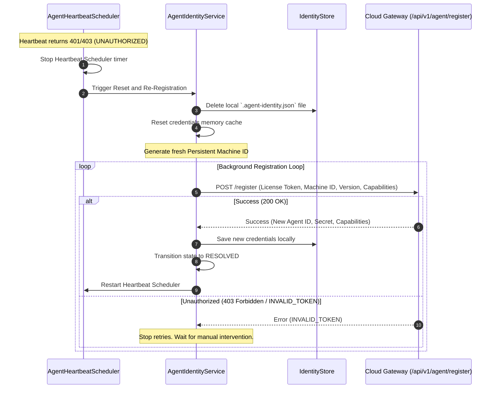

# Execution Watchdog Architecture Manual
## Appendix A — Protocol Sequence Diagrams

This appendix compiles the sequence diagrams and communication sequences for the Execution Watchdog Agent's interaction protocols.

### Mapping of Diagrams to Chapters

| Sequence Diagram | Primary Related Chapter | Target Gateway Endpoint |
| :--- | :--- | :--- |
| **A.1. Agent Registration** | Chapter II — Identity & Registration | `POST /api/v1/agent/register` |
| **A.2. Configuration Synchronization** | Chapter V — Configuration Protocol | `GET /api/v1/agent/config` |
| **A.3. Heartbeat & Capability Negotiation** | Chapter VIII — Scheduler Architecture | `POST /api/v1/agent/heartbeat` |
| **A.4. Recovery & Re-Registration** | Chapter VII — Failure Recovery | `POST /api/v1/agent/register` |

---

### Appendix A.1. Agent Registration Sequence

The registration sequence is executed when the Agent boots up and finds no credentials cached in its local identity store, or when its cached credentials have been corrupted.

#### Key Characteristics
*   **Non-Blocking:** Registration runs on a background scheduler. The main orchestrator continues starting local services (adapters, controllers) to prevent registration delays from freezing local tools.
*   **Fast-Failure on Invalid Credentials:** If the token is invalid, retries are halted immediately, avoiding pointless connection cycles and gateway resource waste.

---

### Appendix A.2. Configuration Synchronization Sequence

The configuration synchronization protocol is executed periodically (default: 5 minutes) to sync settings (thresholds, timings) with the Cloud developer dashboard.

#### Key Characteristics
*   **Revision Header:** The header `X-Configuration-Revision` enables the gateway to return `304 Not Modified` when no updates have been made.
*   **LKG Retention:** If the sync fails due to gateway outages or timeouts, the configuration manager retains its current configuration and revision, keeping the agent monitoring continuously.

---

### Appendix A.3. Heartbeat & Capability Negotiation Sequence

The heartbeat sequence is executed periodically (default: 30 seconds) to notify the Cloud Gateway that the Agent is online, publish local telemetry metrics, and negotiate capabilities.

#### Key Characteristics
*   **Telemetry Gathering:** The heartbeat aggregates CPU load, RAM usage, root partition disk blocks, PostgreSQL connectivity, and Outbox backlog size.
*   **Dynamic Capabilities:** The gateway can update the Agent's allowed capabilities in the heartbeat response, enabling/disabling monitoring routines dynamically.

---

### Appendix A.4. Recovery & Re-Registration Sequence

When the Cloud Gateway rejects the Agent's credentials (returning `401 Unauthorized` or `INVALID_TOKEN` during a heartbeat or config cycle), the Agent self-heals by purging its cache and re-registering.

#### Key Characteristics
*   **Automated Recovery:** The Agent handles invalid credentials automatically, purging the local database/cache configuration and re-negotiating identity without requiring manual restarts of the daemon process.
