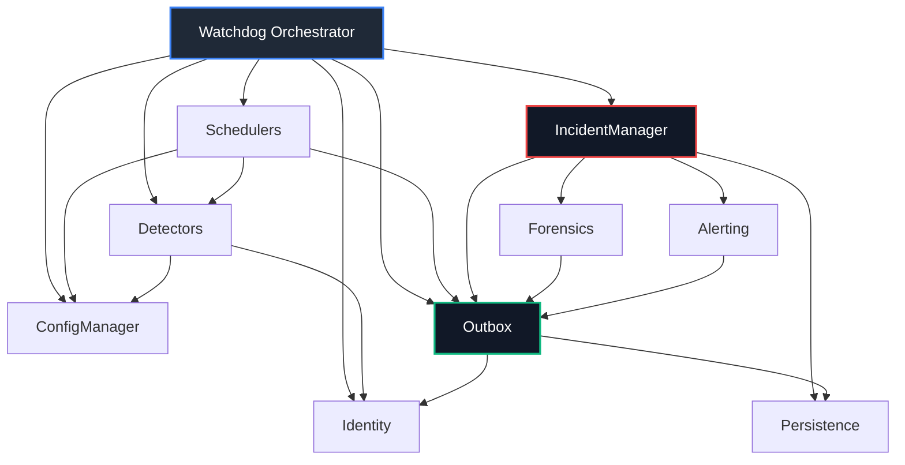

# Execution Watchdog Dependency Map
## Phase 3 — Subsystem Dependency Vectors & Import Rules

This document specifies the permitted dependency vectors between the Execution Watchdog subsystems. It defines what subsystems are allowed to import or instantiate others, preventing circular dependencies and architectural leakage.

---

## 1. Edge Agent Dependency Map

### Dependency Vector Details

| Source Subsystem | Permitted Dependencies (Imports/Calls) | Reason for Permission |
| :--- | :--- | :--- |
| **Watchdog Orchestrator** | Schedulers, Detectors, IncidentManager, Outbox, Identity, ConfigManager | Act as the composition root of the application. |
| **Schedulers** | Detectors, ConfigManager, Outbox | Coordinates execution cycles and triggers ticks. |
| **Telemetry Detectors** | Identity, ConfigManager, Incident Reporting Port | Requires credentials for APIs, configuration parameters, and the contract interface to submit Proposals. |
| **Incident Manager** | Persistence, Alerting, Outbox, Forensics | Persists transitions, triggers alerts, queues sync records, and snatches forensics. |
| **Edge Forensics** | Outbox | Attaches captured diagnostics to Outbox events for transmission. |
| **Alerting Service** | Outbox | Queues formatted alert messages for central delivery. |
| **Outbox Subsystem** | Persistence, Identity | Reads queued rows from the local database and uses active Identity headers to make HTTPS POSTs to the Cloud Gateway. |
| **Identity / Config** | None (Leaf node) | Zero dependencies. Pure parameter/identity store. |
| **Persistence** | None (Leaf node) | Zero dependencies. Pure storage interface. |

---

## 2. Forbidden Dependency Vectors (Anti-Patterns)

The following dependency vectors are strictly **forbidden** and constitute architectural violations:

*   ❌ **Detector &rarr; Scheduler:** Detectors must never know about or control timers, intervals, or task cycle loops.
*   ❌ **Detector &rarr; Persistence:** Detectors must never perform raw database queries or direct table writes.
*   ❌ **Detector &rarr; Alerting / Outbox:** Detectors must never package alert messages or directly write sync payloads.
*   ❌ **Alerting &rarr; Incident Manager:** The alerting subsystem must have no reference to incident manager state, logic, or memory.
*   ❌ **Outbox &rarr; Incident Manager:** The synchronization engine must never read incident business rules or alter incident status fields.
*   ❌ **Persistence &rarr; Any Component:** The database wrapper must never import any other runtime class.
*   ❌ **Edge Subsystems &rarr; Cloud Analysis:** Edge Agent classes must never import or run rules from `cloud/analysis/`.
