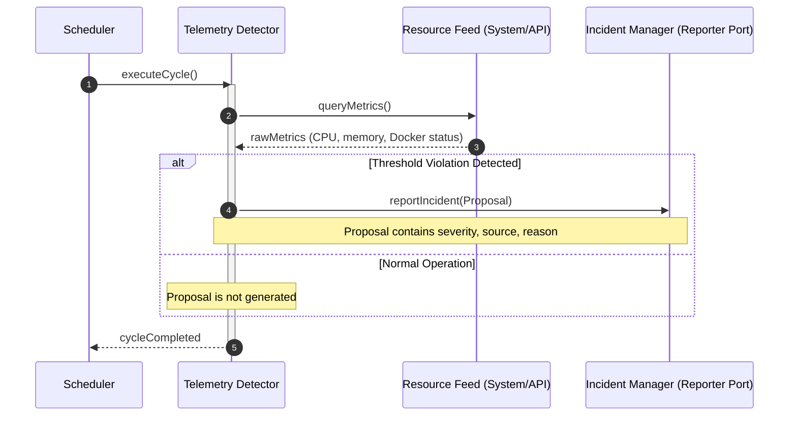
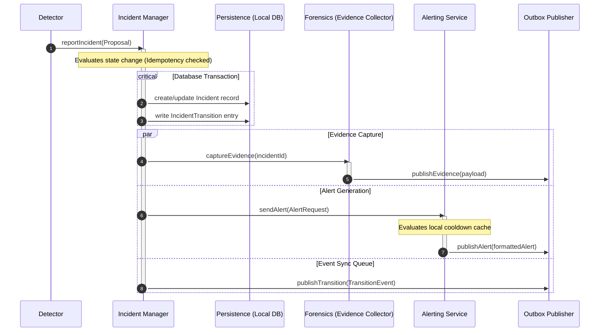
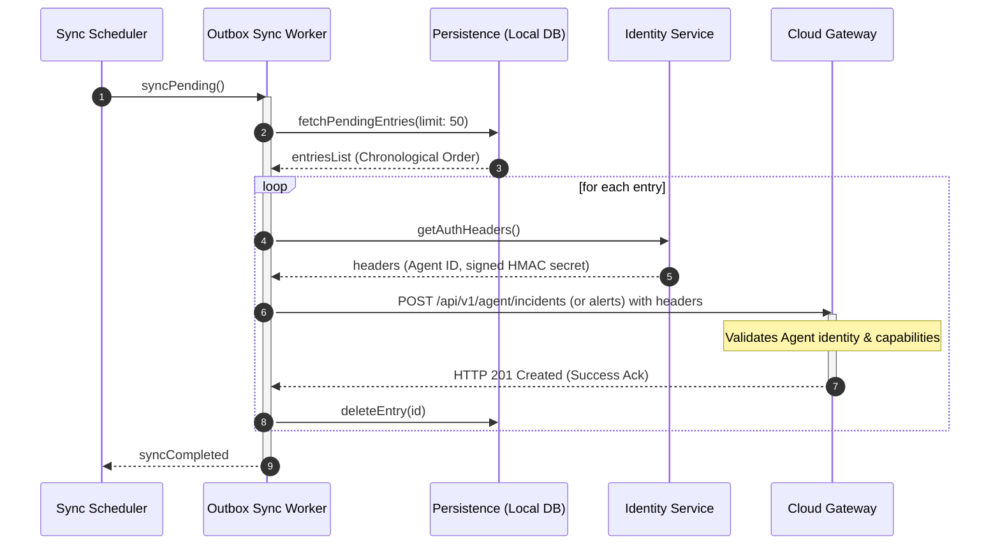

# Execution Watchdog Runtime Sequence Map
## Phase 3.5 — Execution Sequencing & Runtime Interaction Paths

This document maps the step-by-step runtime interaction sequences between subsystems. While the Data Flow Map tracks objects, the Runtime Sequence Map tracks execution flow, callbacks, and invocation boundaries during key operational cycles.

---

## 1. Sequence A: Telemetry Evaluation Loop (Standard Tick)

This sequence details how the system evaluates state periodically on scheduler ticks without modifying state if thresholds are healthy.

---

## 2. Sequence B: State Transition & Persistence Cascade

This sequence is triggered when an `IncidentProposal` submitted to the `IncidentManager` results in an authoritative state change (escalation, new incident, or recovery).

---

## 3. Sequence C: Asynchronous Synchronization Loop

This background sequence handles the delivery of queued outbox records to the Cloud Gateway.

